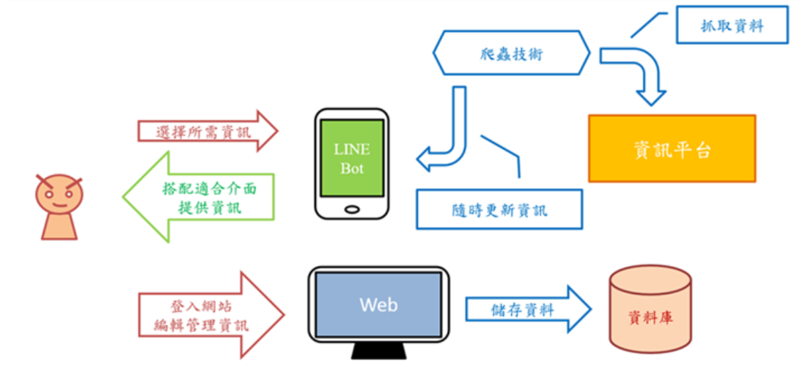

# 基於系所客製化通訊軟體-以Line為例
畢業專題

### <i>技術手冊包含詳盡的安裝過程以及程式碼解說!</i>
### <i>專題報告書對於本專題的所有項目進行詳盡解說，並且附有完整架構與流程，以及最後結果展示。</i>

## 相關連結
實作影片(使用者視角) 
https://youtu.be/0-dQWigrmSE

專題報告 (包含: <b>專題報告書、投影片、海報、技術手冊、專題程式碼</b>) 
https://drive.google.com/drive/folders/1MEtoZz83EIUJybw8laoZZFt92aV5O9Zt?usp=sharing

## 主要功能
為學校以系所角度提供服務,以通訊軟體LINE提供的平台為媒介,快捷的架設好系所帳號功能,讓系所能方便創建LINE官方帳號來管理,再以聊天機器人的形式和網站輔助提供服務,以利於增進師生和系所間的交流。

## 系統介紹
功能模組圖

系統架構圖

