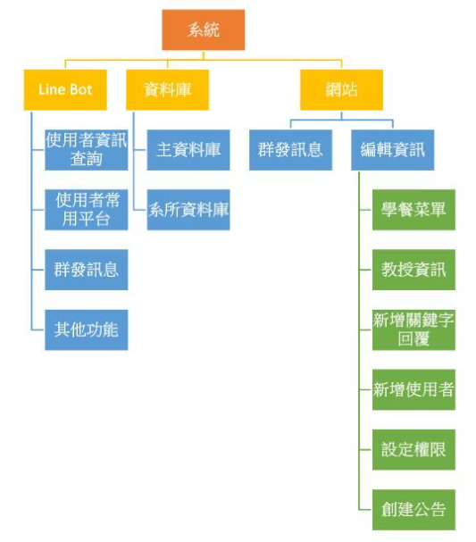

# 基於系所客製化通訊軟體-以Line為例
畢業專題

## 相關連結
### 實作影片
https://youtu.be/0-dQWigrmSE
### 專題報告
https://drive.google.com/drive/folders/1e_PaaOsbM9SMSFxZCW1WsPZO4WLqFWTx?usp=sharing

## 主要功能
為學校以系所角度提供服務,以通訊軟體LINE提供的平台為媒介,快捷的架設好系所帳號功能,
讓系所能方便創建LINE官方帳號來管理,再以聊天機器人的形式和網站輔助提供服務,以利於增
進師生和系所間的交流。

## LINE Bot服務
#### LINE Bot運作圖

實作此專題方法的主要功能皆利用LINE Bot的models提供的各種event實現發送多種類型的訊息，主要使用的Message types有Text message、Sticker message、Image message、Location message、Imagemap message、Template message和Flex message。
	藉由回覆帶有reply token的訊息，以實現回覆功能，也可以藉由使用者id資訊直接推送消息給使用者，以實現推送消息功能。以下將列出使用Line Messaging API的3點功能。
### 使用者資訊查詢
在LINE Bot上會以聊天的模式進行，意即當使用這輸入文字後，會依照文字提及的關鍵字以文字或圖片的方式回應使用者詢問的問題。此時，會需要透過資料庫儲存關鍵字回覆所需的資料(關鍵字及回覆內容)，回覆內容有以下幾種:
1. 文字: 使用Text message進行回覆。
2. 圖片: 使用Image message進行回覆。
3. 訊息圖文選單: 使用Flex message進行回覆，相關實作方法參考 系所消息自動更新。
4. 地址: 使用Location message進行回覆。
### 使用者常用平台
LINE有提供以圖文版面作為選單，是放置於聊天室畫面下方的選單，這樣的版面，不僅能設計創意圖文，觀感上也有絕佳的效果，將常使用的平台搭配圖文選單，讓使用者能更加方便直接點擊前往該頁面。
### 群發訊息
當有消息要告知有加入系所帳號的使用者時，若是人數眾多或有限制是哪一類的人才需看到此訊息的話，群發訊息能達到目的，可以將訊息同時發送給很多人或是選擇特定的對象傳送，這項功能藉由取得使用者UserID(使用者資料會存入資料庫)，可以透過Line Bot API提供的Push API實現，但要注意群發訊息的免費額度有限，使用超出額度會額外收錢。
### 其他功能
以上皆為使用者可以根據自身需求來新增修改的功能，而我們有提供內建的功能，這些是特別針對系所普遍需要的，以下進行說明:
1. 教授資訊: 我們發現大部分學生都會有想要查詢教授資訊的時候，這時我們Line Bot提供了這項功能，來讓學生們可以方便快速查找教授的資訊。這裡我們是採用Flex message進行回覆。
2. 午餐吃甚麼好: 多數人都會有不知道吃什麼的時候，我們針對這點設計了這個功能，當使用者輸入關鍵字後，就會從資料庫的資料中隨機選擇一個食物傳送，並列出商店名稱、商品名稱及價錢。這裡我們是採用Flex message進行回覆。
3. 行事曆: 以學生角度思索，行事曆也是很常學生會找尋的資訊，但若是只單純的回傳行事曆的PDF檔的話，使用者還是要自己慢慢的去瀏覽，因此，利用python套件- pdfplumber分割PDF，來實現PDF轉文字資料。如此一來，就能將範圍縮小，讓使用者能直接流覽。
4. 身份辨識: 由於是針對系所，裡面的成員就會混雜了包含學生、教授、系友及其他。因此我們設計了身分辨識的功能，使用者只需在加入系所Line Bot時選擇自己的身分即可。身份辨識也使用在群發訊息與廣播功能中。
5. 廣播功能:這個是給予教授限定的功能，只要輸入特定格式就可以針對各個身分的使用者進行廣播，可以讓教授們方便傳達各種訊息，要注意這個功能也算在群發訊息中，額度也是有限的。

## 系統介紹
#### 功能模組圖

#### 系統架構圖

## 編輯管理資料: 資料庫
本專題中為每個新申請本服務的系所建立一個專屬的資料庫，因此我們把資料庫分為兩種，主資料庫及系所資料庫。

#### 主資料庫
主資料庫會把各系所的主要資訊紀錄，以下列出主資料庫中重要的資料表: 
1. department: 此資料表包含系所名稱、Line bot API token及Webhook handler。其中Line bot API token及Webhook handler是用於連接Line bot的重要資訊。儲存此資料方法參考 自動化。
2. linebot_user: 此資料表儲存所有註冊網頁服務的使用者帳號，其密碼以sha256加密後存取，也儲存了此使用者屬於哪個系所及權限。
#### 系所資料庫
系所資料庫儲存了該系所所需的資料，例如: 系辦公告、行事曆等。以下列出系所資料庫中的資料表:
1. announcement: 儲存系辦公告爬蟲後的資料。
2. scholarship: 儲存獎學金公告爬蟲後的資料。
3. auth: 此為儲存不同身分的使用者擁有的權限。身分分為五種: admin(最高管理員，可以更改其餘四種身分的權限)、管理員、教師、學生會、一般用戶。權限種類則分為四種: 新增關鍵字回覆、新增使用者、更改資料及群發訊息。
4. calendar: 儲存行事曆解析後的資料，包含年、月、日、週次及內容。
5. food: 儲存午餐菜單的相關資訊。
6. keyword_reply: 儲存關鍵字回覆的相關資訊，包含: 關鍵字、回覆種類(詳情見 關鍵字回覆)及回覆內容。
7. teacher_info: 儲存教授相關資料。
8. user_data: 儲存使用此系所Line bot的用戶資料，包含UserID、姓名、身分等資訊。
